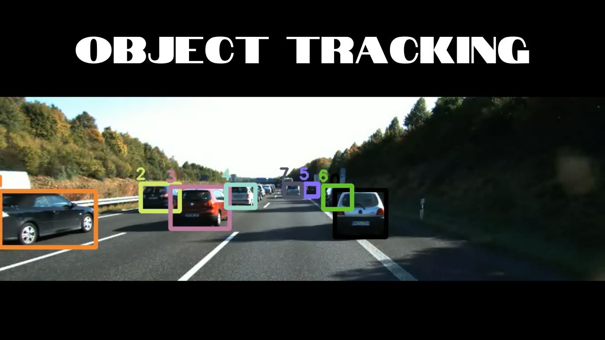

# Object Detection and Tracking with YOLO



## Overview

This project demonstrates object detection and tracking using the YOLO (You Only Look Once) model. We utilize YOLOv8 for real-time object detection and implement tracking using a combination of IoU (Intersection over Union), linear, and exponential cost functions. The Hungarian Algorithm is employed for data association to track objects across frames.

## Features

- **Object Detection**: Detect objects in images using YOLOv8.
- **Tracking**: Track objects across frames with robust cost functions and the Hungarian Algorithm.
- **Visualization**: Display detection results with bounding boxes and labels.
- **Video Processing**: Process a sequence of images to produce a video with tracked objects.

## Installation

1. **Clone the repository:**

   ```bash
   git clone https://github.com/yourusername/object-detection-tracking.git
   cd object-detection-tracking
